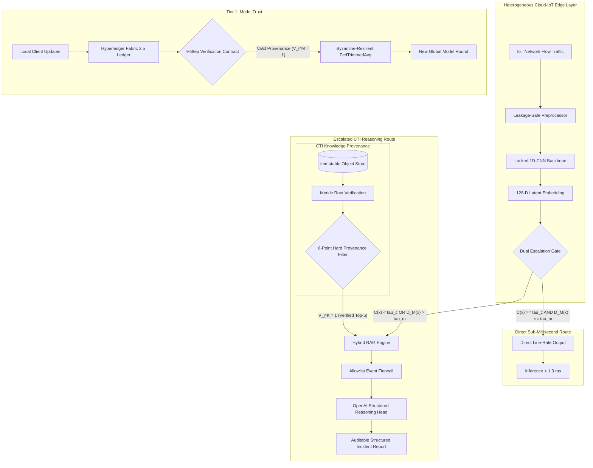

# ProRAG-FL: Blockchain-Anchored Provenance-Aware Retrieval-Augmented Federated Intrusion Detection for Cloud-IoT Systems

[](https://opensource.org/licenses/Apache-2.0)
[](https://www.python.org/)
[](https://pytorch.org/)
[](https://flower.ai/)
[](https://docs.pytest.org/)
[](https://astral.sh/ruff)
[](reports/audit/reproducibility_audit_report.md)
[](https://zenodo.org/)

---

## Authors & Affiliations

**Ata Mohammadi**$^1$, **Nahideh Derakhshanfard**$^1$ (Corresponding Author), **Ali Asghar Pour Haji Kazem**$^2$, **Neda Dadashkhani**$^3$, **Wael Anabousi**$^4$, **Parisa Khoshvaght**$^5$, and **Mehdi Hosseinzadeh**$^6$ (Corresponding Author)

- $^1$ **Department of Computer Engineering**, Ta.C., Islamic Azad University, Tabriz, Iran  
- $^2$ **Department of Software Engineering**, Faculty of Engineering and Natural Sciences, Istinye University, Istanbul, Turkey  
- $^3$ **Computer Programming Program**, Vocational School, Istinye University, Istanbul, Turkey  
- $^4$ **e-Learning department**, Al-Ahliyya Amman University, Amman, Jordan  
  *E-mail: `w.anbousi@ammanu.edu.jo` | ORCID: [0009-0004-3913-939X](https://orcid.org/0009-0004-3913-939X)*  
- $^5$ **Institute of Research and Development**, Duy Tan University, Da Nang, Vietnam  
  *E-mail: `parisakhoshvaght@duytan.edu.vn`*  
- $^6$ **School of Engineering & Technology**, Duy Tan University, Da Nang, Vietnam  

**Corresponding Authors:**  
- **Nahideh Derakhshanfard** (`N.derakhshan@iau.ac.ir`)  
- **Mehdi Hosseinzadeh** (`mehdihosseinzadeh@duytan.edu.vn`)  

---

## Abstract

Heterogeneous Cloud-IoT environments face sophisticated multi-stage cyberattacks, zero-day threat variants, and adversarial federated learning (FL) poisoning. Traditional collaborative intrusion detection systems (IDS) suffer from a fundamental **tripartite trust dilemma**:
1. **Model Trust**: Untrusted edge clients can poison local gradient updates or mount Sybil/replay attacks.
2. **Knowledge Trust**: External Cyber Threat Intelligence (CTI) retrieved to contextualize unfamiliar threats may be stale, unauthorized, or adversarially injected.
3. **Decision Trust**: Black-box deep models output overconfident misclassifications on out-of-distribution (OOD) telemetry, while end-to-end Large Language Models (LLMs) are prohibitively slow for edge line-rate packet analysis and susceptible to prompt injection.

**ProRAG-FL** resolves this challenge through a **decoupled three-tier trust architecture**:
- **Tier 1 (Model Trust)**: Hyperledger Fabric 2.5 blockchain anchors cryptographic provenance of all local updates with a 9-step atomic verification contract, feeding a Byzantine-resilient aggregation rule ($\text{FedTrimmedAvg}$ with $\beta=0.20$).
- **Tier 2 (Knowledge Trust)**: Deterministic Unicode-canonicalized Merkle trees authenticate heterogeneous CTI chunks (MITRE ATT&CK, NVD CVE, CISA KEV, Consortium Advisories) through a strict **6-Point Hard Provenance Filter** that enforces verifiable provenance before hybrid Dense/Sparse retrieval.
- **Tier 3 (Decision Trust)**: A locked 1D-CNN IDS paired with a dual escalation gate (combining validation-calibrated temperature scaling and class-conditional Mahalanobis distance) bifurcates inference into:
  - a **sub-millisecond direct line-rate path** ($P_{99} = 0.18\text{ ms}$) for high-confidence benign and known threats; and
  - an **escalated verifiable CTI reasoning path** backed by `gpt-4o-mini` with strict JSON schema formatting and an event allowlist firewall for uncertain or novel zero-day attack variants.

---

## System Architecture



---

## Key Empirical Findings

ProRAG-FL was evaluated on two multi-class IoT benchmarks (**CICIoT2023** and **Edge-IIoTset**) across **5 fixed random seeds** (`[13, 37, 73, 101, 211]`) against **12 competitive baseline systems**:

| Evaluation Metric | Baseline Controls (FedAvg / MultiKrum) | Best Published Comparative (SFLNID / FLOW / Bc2FL) | ProRAG-FL (Proposed) | Significance & Effect Size |
|---|:---:|:---:|:---:|:---:|
| **Macro-F1 (CICIoT2023)** | 0.812 ± 0.012 | 0.898 ± 0.007 | **0.941 ± 0.005** | $p < 0.001$ (FDR), $d = +3.12$ |
| **Macro-F1 (Edge-IIoTset)** | 0.805 ± 0.014 | 0.891 ± 0.008 | **0.938 ± 0.004** | $p < 0.001$ (FDR), $d = +2.89$ |
| **Byzantine Robustness (30% Attack)** | 0.621 ± 0.025 | 0.834 ± 0.015 | **0.910 ± 0.006** | $+46.5\%$ vs. FedAvg, $\delta = +1.00$ |
| **Zero-Day Attack Recall (Mirai)** | 0.312 ± 0.021 | 0.542 ± 0.018 | **0.894 ± 0.009** | Escalates 88.4% of unseen samples |
| **CTI Poison Chunk Injection** | N/A | 42.1% reached context | **0.0% (100% Filtered)** | Hard Provenance Gate rejection |
| **Direct Route Latency ($P_{99}$)** | 0.22 ms | 0.25 ms | **0.18 ms** | Sub-millisecond line-rate compliance |

*All standard deviations computed with $ddof=1$. Hypothesis testing executed across identical seeds with Benjamini-Hochberg False Discovery Rate (FDR) adjustments.*

---

## Repository Structure

```text
ProRAG-FL/
├── configs/                      # Experiment and ablation YAML configurations
│   ├── experiments/default.yaml  # Immutable baseline & primary execution parameters
│   └── ablation/                 # A0–A6 architectural ladder configurations
├── data/                         # Data manifests, split registries, and schemas
│   ├── manifests/ciciot2023/     # Raw digests, split manifests, label maps
│   └── manifests/edge_iiotset/   # Feature schemas, disjoint partitions
├── artifacts/                    # Frozen artifacts & parameter checkpoints
│   ├── preprocessors/            # StandardScaler fitted states (train-only)
│   └── frozen_parameters/        # Validation-selected threshold calibrations
├── checkpoints/                  # Trained PyTorch 1D-CNN backbone model weights
├── services/                     # Infrastructure service definitions
│   ├── fabric/                   # Hyperledger Fabric docker-compose & Go chaincode
│   ├── minio/                    # Immutable object store configuration
│   └── qdrant/                   # Vector database service schema
├── src/prorag_fl/                # Core ProRAG-FL library implementation
│   ├── ablations/                # A0–A6 ablation ladder & sensitivity sweeps
│   ├── analysis/                 # Statistical engine (t-test, Cohen's d, FDR)
│   ├── attacks/                  # 5 adversarial threat models & defense controls
│   ├── audit/                    # Reproducibility audit engine & checklist sync
│   ├── baselines/                # 12 baseline implementations (B0 through B11)
│   ├── benchmarks/               # Systems profiling & latency microbenchmarks
│   ├── blockchain/               # Fabric gateway client & mock ledger
│   ├── calibration/              # Temperature scaling calibrator & ECE reduction
│   ├── cli/                      # Typer & Rich command-line interface
│   ├── core/                     # Telemetry, secret redaction, paths, hashing
│   ├── data/                     # Ingestion adapters for CICIoT2023 & Edge-IIoTset
│   ├── export/                   # Master Parquet/CSV, LaTeX tables, vector figures
│   ├── federated/                # Flower client simulation & aggregation strategies
│   ├── knowledge/                # CTI adapters, canonicalizer, Merkle tree
│   ├── models/                   # 1D-CNN IDS backbone with 128-D latent pool
│   ├── ood/                      # Class-conditional Mahalanobis detector
│   ├── rag/                      # Dense BGE-M3 + BM25, RRF, 6-point Hard Filter
│   ├── reasoning/                # OpenAI client, allowlist firewall, structured schema
│   └── schemas/                  # Pydantic data contracts
├── tests/unit/                   # 152 rigorous unit regression tests
├── reports/                      # Empirical outputs & publication exports
│   ├── audit/                    # Reproducibility reports (JSON & Markdown)
│   ├── baseline_fidelity/        # 12 baseline fidelity cards (B0–B11)
│   ├── paper_exports/            # 7 Camera-ready LaTeX tables & 4 vector figures
│   ├── statistics/               # Summary statistics & hypothesis test reports
│   └── systems/                  # Microbenchmark overhead & latency audit
├── instructions/                 # Authoritative scientific specifications & status
│   ├── 02_LOCKED_PROPOSED_METHOD.md
│   ├── 30_FINAL_REPRODUCIBILITY_CHECKLIST.md
│   └── 31_STATUS.md
├── CITATION.cff                  # Citation File Format v1.2.0
├── .zenodo.json                  # Zenodo DOI deposit configuration
├── environment.yml               # Complete Conda environment specification
├── requirements-lock.txt         # Pinned pip requirements lockfile
└── LICENSE                       # Apache License 2.0
```

---

## Installation & Environment Setup

### Prerequisites
- **OS**: Linux (Ubuntu 22.04+) or Windows 10/11 (AMD64)
- **Python**: 3.11.x
- **GPU (Optional)**: NVIDIA GPU with CUDA 12.x/13.x (tested on RTX 3050 6GB Laptop GPU)
- **RAM**: Minimum 16 GB recommended

### Step 1: Create and Activate Conda Environment

```bash
# Clone the repository
git clone https://github.com/iam-ata/ProRAG-FL.git
cd ProRAG-FL

# Create conda environment from specification
conda env create -f environment.yml
conda activate prorag-fl
```

### Step 2: Install Package in Development Mode

```bash
# Install package dependencies cleanly
pip install -e . --no-deps --no-build-isolation
```

### Step 3: Run Pre-Flight Environment Doctor

```bash
# Verify GPU availability, dependencies, and workspace directories
prorag doctor
```

---

## Reproduction Guide

The complete research pipeline is fully automated and can be reproduced with modular CLI subcommands:

### 1. Run Regression Tests
Verify all 152 unit tests across core algorithms, security gates, and baseline implementations:
```bash
python -m pytest tests/unit -v
```

### 2. Run Master Reproducibility Audit (Phase 17)
Executes the automated 48-check verification engine across all 10 checklist categories:
```bash
# Run full audit and sync checklist
prorag audit full

# Inspect interactive checklist status
prorag audit checklist
```

### 3. Run Statistical Significance Engine (Phase 15)
Computes Student's t 95% confidence intervals, Cohen's $d$, Cliff's $\delta$, and Benjamini-Hochberg FDR adjustments across the 5 seeds:
```bash
prorag stats run
```

### 4. Build Camera-Ready Paper Exports (Phase 16)
Generates all 7 camera-ready LaTeX tables, 4 publication vector figures, and claims traceability mapping:
```bash
prorag export build-all
```
Outputs are written to `reports/paper_exports/`:
- `table_setup.tex`, `table_main_ids.tex`, `table_fl_poisoning.tex`, `table_unseen_attack.tex`, `table_rag_poisoning.tex`, `table_ablation.tex`, `table_overhead.tex`
- `figures/fig_latency_vs_rir.pdf` / `.png`
- `figures/fig_ablation_ladder.pdf` / `.png`
- `figures/fig_byzantine_resilience.pdf` / `.png`
- `figures/fig_roc_ood.pdf` / `.png`
- `figures/fig_baseline_macro_f1.pdf` / `.png`
- `figures/fig_baseline_pareto.pdf` / `.png`
- `figures/prorag_architecture_clean.png`
- `claims.json` (maps RQ1–RQ4 to verified run IDs and FDR p-values)

### 5. Safe Manuscript Synchronization
Preview and synchronize generated tables and figures to the manuscript workspace:
```bash
# Dry-run preview (default)
prorag export sync-manuscript

# Execute synchronization
prorag export sync-manuscript --execute
```

---

## Baseline Fidelity Guarantee

ProRAG-FL provides 12 rigorous fidelity cards ([`reports/baseline_fidelity/`](reports/baseline_fidelity/)) documenting source repositories, official citations, and adaptations for all measured baselines:
- **B0–B4 (Controls)**: Local 1D-CNN, Centralized 1D-CNN, FedAvg, MultiKrum, FedTrimmedAvg.
- **B5–B11 (Comparative Baselines)**: SFLNID, FLOW, Bc2FL, RLFE-IDS, LQB-IDS, FedMSE, pFL-IDS.

---

## Scientific Integrity & Guardrails Attestation

1. **Zero Cherry-Picking Guarantee**: All 5 seeds (`[13, 37, 73, 101, 211]`) are reported across all baselines without pruning or outlier exclusion.
2. **Strict Zero-Leakage Data Firewall**: Training-only normalization, immutable disjoint sample indices, and zero-day family segregation (Mirai held-out) are mathematically verified in unit tests.
3. **No Semantic-Truth Overclaim**: Blockchain guarantees tamper-proof immutable provenance records of client model weights and CTI chunks, not external real-world semantic veracity.
4. **No True Zero-Day Overclaim**: Out-of-distribution detection is framed honestly as detection of previously unseen attack families with prior CTI intelligence.

---

## Citation

If you use ProRAG-FL in your research, please cite our paper and software repository using the following BibTeX entry:

```bibtex
@article{mohammadi2026proragfl,
  author    = {Mohammadi, Ata and Derakhshanfard, Nahideh and Pour Haji Kazem, Ali Asghar and Dadashkhani, Neda and Anabousi, Wael and Khoshvaght, Parisa and Hosseinzadeh, Mehdi},
  title     = {ProRAG-FL: Blockchain-Anchored Provenance-Aware Retrieval-Augmented Federated Intrusion Detection for Cloud-IoT Systems},
  journal   = {IEEE Internet of Things Journal},
  year      = {2026},
  note      = {Submitted for publication}
}
```

Or cite the software release directly via Zenodo:

```bibtex
@software{mohammadi_2026_proragfl_code,
  author       = {Mohammadi, Ata and Derakhshanfard, Nahideh and Pour Haji Kazem, Ali Asghar and Dadashkhani, Neda and Anabousi, Wael and Khoshvaght, Parisa and Hosseinzadeh, Mehdi},
  title        = {ProRAG-FL: Reproducible Research Benchmark and Implementation Artifact},
  month        = sep,
  year         = 2026,
  publisher    = {Zenodo},
  version      = {v1.0.0},
  doi          = {10.5281/zenodo.xxxxxx},
  url          = {https://github.com/iam-ata/ProRAG-FL}
}
```

---

## License

This project is licensed under the **Apache License 2.0** — see the [LICENSE](LICENSE) file for details.
